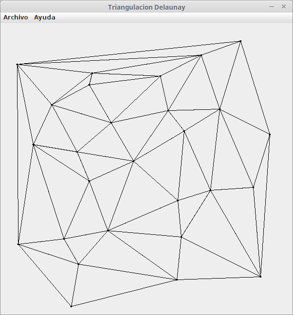

# Delaunay Triangulation using Bowyer-Watson Algorithm

Based on the work of Paul Borke: http://paulbourke.net/papers/triangulate/ (first Java conversion by Florian Jenett).

Based on the adaptation of Tom Carden and the modifications by Daniel Shiffman.

(For personal and academic reasons, the code comments are in Spanish, but all functions and variables are in English. Also I tried to make those names the most undestandable possible. If you don't understand something, just send me an email.)
