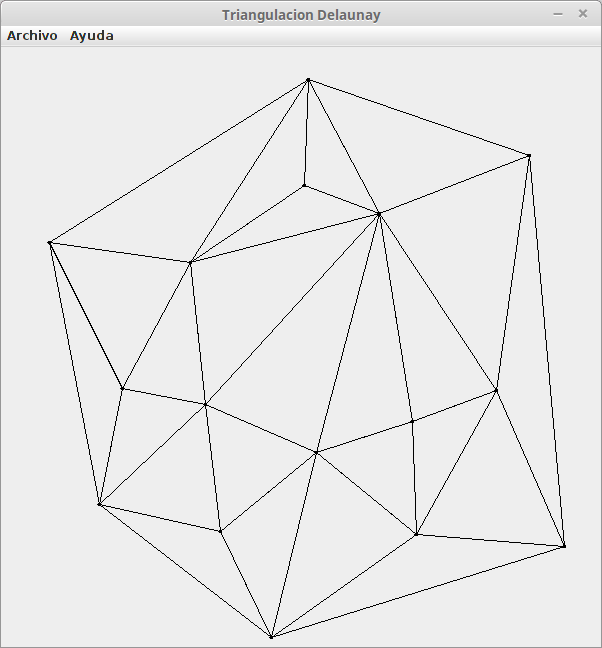

# Delaunay Triangulation

Delaunay Triangulation using Bowyer-Watson Algorithm

Based on the work of Paul Borke: http://paulbourke.net/papers/triangulate/ (first Java conversion by Florian Jenett).

Based on the adaptation of Tom Carden and the modifications by Daniel Shiffman.

